# 📚 Complete Workflow Documentation: Black Sigatoka Early Stage Detection

## 🎯 Project Overview

This project detects and classifies **Black Sigatoka disease stages** in banana leaves using **YOLO object detection**. The system identifies **7 classes**: Healthy, Stage1, Stage2, Stage3, Stage4, Stage5, and Stage6.

---

## 📊 Data Split Proportions

### ✅ **ACTUAL SPLIT: 70% / 15% / 15%**

```
┌─────────────────────────────────────────┐
│         TOTAL DATASET (100%)            │
├─────────────────────────────────────────┤
│                                         │
│  ┌──────────────┐  ┌──────────┐       │
│  │   TRAIN      │  │   VAL    │       │
│  │    70%       │  │   15%    │       │
│  │              │  │          │       │
│  │  • Learning  │  │  • Tuning │       │
│  │  • Fitting  │  │  • Early  │       │
│  │             │  │    Stop   │       │
│  └──────────────┘  └──────────┘       │
│                                         │
│         ┌──────────┐                  │
│         │   TEST   │                  │
│         │   15%    │                  │
│         │          │                  │
│         │  • Final │                  │
│         │  • Eval  │                  │
│         └──────────┘                  │
└─────────────────────────────────────────┘
```

**Implementation:**
```python
# Step 1: 70% train, 30% val+test
train_df, val_test_df = train_test_split(
    labels_df, 
    test_size=0.3,  # 30% for val+test
    random_state=42,
    stratify=labels_df['class_label']  # Maintain class balance
)

# Step 2: 30% → 15% val + 15% test
val_df, test_df = train_test_split(
    val_test_df,
    test_size=0.5,  # Split 30% into 15% val + 15% test
    random_state=42,
    stratify=val_test_df['class_label']
)

# Final: 70% Train / 15% Validation / 15% Test ✅
```

**Why this split?**
- **70% Training**: Maximum data for model learning
- **15% Validation**: Sufficient for hyperparameter tuning and early stopping
- **15% Test**: Adequate for unbiased final evaluation

---

## 🔄 Complete Workflow Diagram

### Overview: How Phases Connect


---

### 📦 PHASE 1: DATA PREPROCESSING
**Notebook:** `data-labeling-classification.ipynb`

```mermaid
flowchart TD
    Start([🌿 Raw Banana Leaf Images<br/>Stage1, Stage2, Stage3 folders]) --> QC[🔍 Image Quality Assessment]
    
    QC --> QC1[Blur Check<br/>Laplacian ≥ 100.0]
    QC --> QC2[Brightness Check<br/>20-240 range]
    QC --> QC3[Resolution Check<br/>Min 256x256]
    QC --> QC4[File Size Check<br/>50KB-10MB]
    
    QC1 --> Tiling[✂️ Image Tiling<br/>Split into 256x256 tiles]
    QC2 --> Tiling
    QC3 --> Tiling
    QC4 --> Tiling
    
    Tiling --> Split[📊 Data Splitting<br/>Stratified by Class]
    Split --> Split1[Train: 70%<br/>~436 images]
    Split --> Split2[Val: 15%<br/>~94 images]
    Split --> Split3[Test: 15%<br/>~94 images]
    
    Split1 --> Aug[🔄 Data Augmentation<br/>Train Set Only]
    Aug --> Aug1[Rotation 0-360°]
    Aug --> Aug2[Brightness ±25%]
    Aug --> Aug3[Crop/Zoom 76-100%]
    Aug --> Aug4[Horizontal Flip 50%]
    
    Aug1 --> YOLO[📝 YOLO Format Conversion]
    Aug2 --> YOLO
    Aug3 --> YOLO
    Aug4 --> YOLO
    Split2 --> YOLO
    Split3 --> YOLO
    
    YOLO --> Output[✅ BSED Dataset<br/>yolo_classification_dataset/<br/>data.yaml + labels]
    
    style Start fill:#fff9c4,stroke:#f57f17,stroke-width:2px
    style Output fill:#e8f5e9,stroke:#2e7d32,stroke-width:2px
```



---

### 🔀 PHASE 2: DATASET MERGING
**Notebook:** `bsed-datasets-merge.ipynb`

```mermaid
flowchart TD
    BSED[📦 BSED Dataset<br/>Stage1, Stage2, Stage3] --> Phase2[🔀 Dataset Merging]
    Roboflow[📦 Roboflow Dataset<br/>Functional, Mild, Moderate, Severe] --> Phase2
    
    Phase2 --> Map[🗺️ Class Mapping]
    Map --> Map1[Functional → Healthy<br/>ID: 0]
    Map --> Map2[Stage1 → Stage1<br/>ID: 1]
    Map --> Map3[Stage2 → Stage2<br/>ID: 2]
    Map --> Map4[Stage3 → Stage3<br/>ID: 3]
    Map --> Map5[Mild → Stage4<br/>ID: 4]
    Map --> Map6[Moderate → Stage5<br/>ID: 5]
    Map --> Map7[Severe → Stage6<br/>ID: 6]
    
    Map1 --> Process[🔧 Process Datasets]
    Map2 --> Process
    Map3 --> Process
    Map4 --> Process
    Map5 --> Process
    Map6 --> Process
    Map7 --> Process
    
    Process --> Update1[Update Class IDs<br/>in label files]
    Process --> Update2[Rename image files<br/>with new class names]
    Process --> Copy[Copy to combined<br/>dataset structure]
    
    Update1 --> Merge[🔗 Merge Datasets]
    Update2 --> Merge
    Copy --> Merge
    
    Merge --> YAML[📝 Create Combined<br/>data.yaml]
    YAML --> Output[✅ Combined Dataset<br/>combined_yolo_dataset/<br/>7 Classes: Healthy + Stage1-6]
    
    style Phase2 fill:#fff3e0,stroke:#e65100,stroke-width:2px
    style Output fill:#e8f5e9,stroke:#2e7d32,stroke-width:2px
```



---

### 🚀 PHASE 3: MODEL TRAINING
**Notebook:** `bsed-training.ipynb`

```mermaid
flowchart TD
    Start([📂 Combined Dataset<br/>combined_yolo_dataset/]) --> Load[Load Dataset<br/>Verify Split 70/15/15]
    
    Load --> Setup[⚙️ Setup Model<br/>YOLO12n + GPU Check]
    Setup --> Config[🎛️ Configure Hyperparameters<br/>lr0=0.001, batch=32<br/>imgsz=736, optimizer=AdamW]
    
    Config --> Train[🏋️ Start Training]
    Train --> Loop[Training Loop<br/>For each epoch]
    
    Loop --> Batch[Load Batch from<br/>TRAIN Set]
    Batch --> Augment[Apply Real-time<br/>Augmentation]
    Augment --> Forward[Forward Pass<br/>Get Predictions]
    Forward --> Loss[Compute Loss<br/>box + cls + dfl]
    Loss --> Backward[Backward Pass<br/>Calculate Gradients]
    Backward --> Update[Update Weights<br/>Optimizer Step]
    
    Update --> Epoch{More Epochs?<br/>or Early Stop?}
    Epoch -->|Yes| Loop
    Epoch -->|No| Validate[✅ Validate on<br/>VALIDATION Set]
    
    Validate --> Metrics[📈 Compute Metrics<br/>mAP50, mAP50-95<br/>Precision, Recall]
    Metrics --> Save[💾 Save Best Model<br/>best.pt]
    Save --> Overfit[🔬 Overfitting Analysis<br/>Train vs Val Loss]
    
    Overfit --> Test[🧪 Test Set Evaluation<br/>⚠️ ONCE ONLY!]
    Test --> Final[📊 Final Metrics<br/>Per-class Performance]
    Final --> Viz[🖼️ Visualize Predictions]
    Viz --> End([🎉 Trained Model<br/>best.pt + Results])
    
    style Start fill:#fff9c4,stroke:#f57f17,stroke-width:2px
    style Test fill:#ffebee,stroke:#c62828,stroke-width:2px
    style End fill:#e8f5e9,stroke:#2e7d32,stroke-width:2px
```



### ASCII Diagram (Alternative View)

```
┌─────────────────────────────────────────────────────────────────────────┐
│                    PHASE 1: DATA PREPROCESSING                          │
│                    (data-labeling-classification.ipynb)                 │
├─────────────────────────────────────────────────────────────────────────┤
│                                                                          │
│  Raw Images → Quality Check → Tiling → Splitting → Augmentation        │
│     ↓              ↓              ↓         ↓            ↓               │
│  • Stage folders • Blur check  • 256x256 • 70/15/15  • Rotation       │
│  • JPG/PNG      • Brightness   • Tiles   • Stratified • Brightness     │
│  • Organize     • Resolution   • Labels  • Random    • Crop/Zoom       │
│                 • File size    • Inherit • state=42   • Flip           │
│                                                                          │
│  Output: yolo_classification_dataset/ (BSED dataset)                    │
│                                                                          │
└─────────────────────────────────────────────────────────────────────────┘
                            ↓
┌─────────────────────────────────────────────────────────────────────────┐
│                    PHASE 2: DATASET MERGING                              │
│                    (bsed-datasets-merge.ipynb)                          │
├─────────────────────────────────────────────────────────────────────────┤
│                                                                          │
│  BSED Dataset + Roboflow Dataset → Class Mapping → Combined Dataset    │
│     ↓                    ↓                    ↓              ↓          │
│  • Stage1-3          • Functional        • Map classes   • Combined    │
│  • YOLO format       • Mild/Mod/Severe  • Update IDs    • data.yaml   │
│  • 7 classes         • 4 classes         • Rename files  • All splits  │
│                                                                          │
│  Class Mapping:                                                          │
│  • Functional → Healthy (ID: 0)                                         │
│  • Stage1 → Stage1 (ID: 1)                                               │
│  • Stage2 → Stage2 (ID: 2)                                               │
│  • Stage3 → Stage3 (ID: 3)                                               │
│  • Mild → Stage4 (ID: 4)                                                 │
│  • Moderate → Stage5 (ID: 5)                                             │
│  • Severe → Stage6 (ID: 6)                                               │
│                                                                          │
│  Output: combined_yolo_dataset/ (7 classes, merged data)                │
│                                                                          │
└─────────────────────────────────────────────────────────────────────────┘
                            ↓
┌─────────────────────────────────────────────────────────────────────────┐
│                    PHASE 3: MODEL TRAINING                               │
│                    (bsed-training.ipynb)                                 │
├─────────────────────────────────────────────────────────────────────────┤
│                                                                          │
│  Load Dataset → Setup Model → Configure → Train → Validate → Test      │
│     ↓              ↓             ↓          ↓         ↓         ↓       │
│  • data.yaml    • YOLO12n     • Hyperparams • Epochs  • mAP50   • Final │
│  • Verify split • GPU check   • Augment     • Monitor • Loss    • ONCE  │
│  • Count images • Load model  • Optimizer   • Save    • Early   • Eval  │
│                                                                          │
│  Output: Trained model (best.pt, last.pt) + Metrics                    │
│                                                                          │
└─────────────────────────────────────────────────────────────────────────┘
```

---

## 📋 Detailed Workflow Steps

### **PHASE 1: Data Preprocessing** (`data-labeling-classification.ipynb`)

#### **Step 1.1: Image Quality Assessment**

**Purpose:** Filter out low-quality images

**Specifications:**
```python
QUALITY_THRESHOLDS = {
    "min_resolution": (256, 256),      # Minimum width, height
    "max_blur_threshold": 100.0,      # Laplacian variance (lower = blurrier)
    "min_brightness": 20,              # Minimum average brightness (0-255)
    "max_brightness": 240,             # Maximum average brightness (0-255)
    "min_file_size_kb": 50,           # Minimum file size in KB
    "max_file_size_mb": 10,            # Maximum file size in MB
}
```

**Checks Performed:**
1. **Resolution Check**: Minimum 256x256 pixels
2. **Blur Detection**: Laplacian variance ≥ 100.0
3. **Brightness Check**: Average brightness between 20-240
4. **File Size Check**: Between 50KB - 10MB

**Code Location:** `data-labeling-classification.ipynb` Cell 2-4

**Output:** Quality-assessed images with metadata

---

#### **Step 1.2: Image Tiling**

**Purpose:** Create more training samples from limited data

**Specifications:**
- **Tile Size**: 256x256 pixels
- **Naming Convention**: `{Stage}_{OriginalName}_tile_{row}_{col}.jpg`
- **Label Inheritance**: Each tile inherits class label from parent image

**Process:**
1. Load large images (e.g., 2296x4080)
2. Split into 256x256 tiles with overlap
3. Assign same class label to all tiles from same image
4. Save tiles with proper naming

**Code Location:** `data-labeling-classification.ipynb` Cell 5-6

**Output:** Tiled images (e.g., 624 images from original set)

---

#### **Step 1.3: Data Splitting**

**Purpose:** Split dataset into train/validation/test sets

**Specifications:**
- **Method**: Stratified split (maintains class distribution)
- **Random State**: 42 (reproducible)
- **Proportions**: 70% / 15% / 15%

**Implementation:**
```python
# Two-step stratified split
# Step 1: 70% train, 30% val+test
train_df, val_test_df = train_test_split(
    labels_df,
    test_size=0.3,
    random_state=42,
    stratify=labels_df['class_label']
)

# Step 2: 30% → 15% val + 15% test
val_df, test_df = train_test_split(
    val_test_df,
    test_size=0.5,
    random_state=42,
    stratify=val_test_df['class_label']
)
```

**Code Location:** `data-labeling-classification.ipynb` Cell 8

**Output:** 
- Train: ~436 images
- Validation: ~94 images
- Test: ~94 images

---

#### **Step 1.4: Data Augmentation (Preprocessing)**

**Purpose:** Increase training data diversity

**Specifications:**
```python
AUGMENTATION_CONFIG = {
    'rotation_range': 360,           # Full rotation
    'brightness_range': 0.25,        # ±25% brightness variation
    'crop_min_zoom': 0.76,           # 76% minimum zoom
    'crop_max_zoom': 1.0,            # 100% maximum zoom
    'horizontal_flip': True,         # 50% probability
}
```

**Applied To:** TRAIN set only (not validation/test)

**Augmentations:**
1. **Rotation**: Random angles (0-360°)
2. **Brightness**: ±25% variation
3. **Crop/Zoom**: 76%-100% zoom range
4. **Horizontal Flip**: 50% probability

**Code Location:** `data-labeling-classification.ipynb` Cell 13-14

**Output:** 
- Original train: ~436 images
- After augmentation: ~872 images (doubled)

---

#### **Step 1.5: YOLO Format Conversion**

**Purpose:** Convert to YOLO object detection format

**Specifications:**
- **Format**: YOLO format (normalized coordinates)
- **Structure**: 
  ```
  yolo_classification_dataset/
  ├── train/
  │   ├── images/
  │   └── labels/
  ├── valid/
  │   ├── images/
  │   └── labels/
  ├── test/
  │   ├── images/
  │   └── labels/
  └── data.yaml
  ```

**YOLO Label Format:**
```
class_id x_center y_center width height
(All values normalized 0.0-1.0)
```

**Class Mapping:**
- 0: Healthy
- 1: Stage1
- 2: Stage2
- 3: Stage3
- 4: Stage4
- 5: Stage5
- 6: Stage6

**Code Location:** `data-labeling-classification.ipynb` Cell 25-26

**Output:** `yolo_classification_dataset/` with `data.yaml`

---

### **PHASE 2: Dataset Merging** (`bsed-datasets-merge.ipynb`)

#### **Step 2.1: Load Datasets**

**Purpose:** Load BSED and Roboflow datasets

**Datasets:**
1. **BSED Dataset**: Contains Stage1, Stage2, Stage3
2. **Roboflow Dataset**: Contains Functional, Mild, Moderate, Severe

**Code Location:** `bsed-datasets-merge.ipynb` Cell 0-1

---

#### **Step 2.2: Class Mapping Configuration**

**Purpose:** Map different class names to unified scheme

**Final Class Order:**
```python
FINAL_CLASS_ORDER = ['Healthy', 'Stage1', 'Stage2', 'Stage3', 'Stage4', 'Stage5', 'Stage6']
```

**Roboflow Class Mapping:**
```python
ROBOFLOW_CLASS_NAME_MAPPING = {
    'Functional': 'Healthy',   # Functional → Healthy (ID: 0)
    'Mild': 'Stage4',          # Mild → Stage4 (ID: 4)
    'Moderate': 'Stage5',      # Moderate → Stage5 (ID: 5)
    'Severe': 'Stage6'          # Severe → Stage6 (ID: 6)
}

ROBOFLOW_CLASS_ID_MAPPING = {
    '0': 'Functional',   # Label file ID 0 → Functional → Healthy
    '1': 'Mild',         # Label file ID 1 → Mild → Stage4
    '2': 'Moderate',     # Label file ID 2 → Moderate → Stage5
    '3': 'Severe'         # Label file ID 3 → Severe → Stage6
}
```

**BSED Class Mapping:**
- Stage1 → Stage1 (ID: 1) - Direct mapping
- Stage2 → Stage2 (ID: 2) - Direct mapping
- Stage3 → Stage3 (ID: 3) - Direct mapping

**Code Location:** `bsed-datasets-merge.ipynb` Cell 3

---

#### **Step 2.3: Process and Merge Datasets**

**Purpose:** Combine datasets with class remapping

**Process:**
1. **Roboflow Dataset:**
   - Copy images and labels
   - Update class IDs in label files
   - Rename image files (replace class names)

2. **BSED Dataset:**
   - Copy images and labels
   - Update class IDs to final IDs
   - Keep original filenames

3. **Combine:**
   - Merge train/valid/test splits
   - Create unified `data.yaml`
   - Verify label files match images

**Code Location:** `bsed-datasets-merge.ipynb` Cell 4-5

**Output:** `combined_yolo_dataset/` with 7 classes

---

#### **Step 2.4: Create Combined data.yaml**

**Purpose:** Generate unified configuration file

**Configuration:**
```yaml
path: /path/to/combined_yolo_dataset
train: train/images
val: valid/images
test: test/images
names:
  0: Healthy
  1: Stage1
  2: Stage2
  3: Stage3
  4: Stage4
  5: Stage5
  6: Stage6
nc: 7
```

**Code Location:** `bsed-datasets-merge.ipynb` Cell 6

**Output:** `combined_yolo_dataset/data.yaml`

---

### **PHASE 3: Model Training** (`bsed-training.ipynb`)

#### **Step 3.1: Dataset Loading**

**Purpose:** Load and verify combined dataset

**Process:**
1. Copy dataset to working directory
2. Load `data.yaml` configuration
3. Update paths if needed
4. Count images in each split
5. Verify split proportions

**Code Location:** `bsed-training.ipynb` Cell 5

**Output:** Dataset loaded and verified

---

#### **Step 3.2: Model Setup**

**Purpose:** Initialize YOLO model

**Model Options:**
- `yolo12n.pt` - Nano (fastest, smallest) ✅ **Current**
- `yolo12s.pt` - Small (better accuracy)
- `yolo12m.pt` - Medium (good balance)
- `yolo12l.pt` - Large (best accuracy)
- `yolo12x.pt` - Extra Large (maximum accuracy)

**Code Location:** `bsed-training.ipynb` Cell 7

**Output:** YOLO model initialized

---

#### **Step 3.3: Hyperparameter Configuration**

**Purpose:** Configure training parameters

**Current Configuration:**
```python
training_config = {
    # Basic settings
    'data': data_yaml_path,
    'epochs': 10,
    'imgsz': 736,              # Image size (640, 736, 1280)
    'batch': 32,               # Batch size (8, 16, 32, 64)
    'patience': 20,            # Early stopping patience
    'device': 0,               # GPU device (0 for first GPU)
    
    # Optimizer
    'optimizer': 'AdamW',      # Options: SGD, Adam, AdamW
    'lr0': 0.001,              # Initial learning rate
    'lrf': 0.01,               # Final LR = lr0 * lrf
    'momentum': 0.937,         # SGD momentum
    'weight_decay': 0.0005,
    'warmup_epochs': 5,        # Warmup epochs
    'warmup_momentum': 0.8,
    'warmup_bias_lr': 0.1,
    
    # Loss weights
    'box': 7.5,                # Bounding box loss weight
    'cls': 0.5,                # Classification loss weight
    'dfl': 1.5,                # Distribution focal loss weight
    
    # Data augmentation (real-time during training)
    'hsv_h': 0.015,            # Hue variation
    'hsv_s': 0.7,              # Saturation variation
    'hsv_v': 0.4,              # Brightness variation
    'degrees': 10.0,           # Rotation degrees
    'translate': 0.1,          # Translation
    'fliplr': 0.5,             # Horizontal flip probability
    'scale': 0.7,              # Scale variation
    'shear': 2.0,              # Shear transformation
    'perspective': 0.0001,     # Perspective transformation
    'flipud': 0.0,             # Vertical flip (0.0 for leaves)
    'mosaic': 1.0,             # Mosaic augmentation probability
    'mixup': 0.1,              # Mixup augmentation probability
    'copy_paste': 0.1,         # Copy-paste augmentation
    'auto_augment': 'randaugment',
    'erasing': 0.4,            # Random erasing
    
    # Advanced settings
    'multi_scale': False,      # Multi-scale training
    'conf': 0.25,              # Confidence threshold
    'iou': 0.7,                # IoU threshold for NMS
    'close_mosaic': 15,        # Disable mosaic last N epochs
    'cos_lr': True,            # Cosine learning rate scheduler
    'nbs': 64,                 # Nominal batch size
    'overlap_mask': True,
    'mask_ratio': 4,
    'dropout': 0.0,
    
    # Validation and saving
    'val': True,               # Validate during training
    'plots': True,             # Generate plots
    'save_json': True,         # Save JSON results
    'verbose': True,           # Verbose output
    'deterministic': False,    # Reproducibility
    
    # Project settings
    'name': 'banana_pest_disease_yolo11',
    'project': 'runs/detect',
    'exist_ok': True,
    'workers': 8,              # Data loading workers
}
```

**Hyperparameter Tuning Strategy:**
1. Start with default values
2. Train for 5-10 epochs
3. Check validation mAP50
4. Adjust one parameter at a time:
   - **If mAP50 low**: Increase epochs, use larger model, check data
   - **If overfitting**: Increase augmentation, add more data
   - **If underfitting**: Train longer, use larger model, reduce augmentation
5. Use validation set for evaluation
6. Keep test set untouched!

**Code Location:** `bsed-training.ipynb` Cell 8

---

#### **Step 3.4: Model Training**

**Purpose:** Train YOLO model on combined dataset

**Training Process:**
```
For each epoch:
    1. Load batch from TRAIN set
    2. Apply real-time augmentation
    3. Forward pass → Get predictions
    4. Compute loss (box + cls + dfl)
    5. Backward pass → Calculate gradients
    6. Update weights (optimizer step)
    7. Log training metrics
    
    After each epoch:
    8. Validate on VALIDATION set
    9. Compute mAP50, mAP50-95, precision, recall
    10. Check for early stopping
    11. Save best model (if improved)
```

**Training Stops When:**
- Maximum epochs reached (10)
- Early stopping triggered (no improvement for 20 epochs)
- Manual interruption

**Code Location:** `bsed-training.ipynb` Cell 8

**Output:**
- `runs/detect/banana_pest_disease_yolo11/weights/best.pt` - Best model
- `runs/detect/banana_pest_disease_yolo11/weights/last.pt` - Last epoch model
- `runs/detect/banana_pest_disease_yolo11/results.csv` - Training metrics
- `runs/detect/banana_pest_disease_yolo11/results.png` - Training plots

---

#### **Step 3.5: Validation (During Training)**

**Purpose:** Monitor training progress and prevent overfitting

**When:** After each epoch

**Metrics Computed:**
- **mAP50**: Mean Average Precision at IoU=0.5 (main metric)
- **mAP50-95**: mAP across IoU 0.5-0.95 (stricter metric)
- **Precision**: True Positives / (TP + FP)
- **Recall**: True Positives / (TP + FN)
- **F1 Score**: 2 × (Precision × Recall) / (Precision + Recall)
- **Loss**: Box loss + Classification loss + DFL loss

**What to Monitor:**
- ✅ **Good Training**: 
  - mAP50 increasing
  - Train loss decreasing
  - Val loss decreasing
  - Small gap between train and val loss (< 0.1)

- ⚠️ **Overfitting**:
  - Train loss low but val loss high
  - Gap between train and val loss > 0.15
  - mAP50 on val set not improving

- ⚠️ **Underfitting**:
  - Both train and val loss high
  - mAP50 < 0.5
  - Model not learning

**Code Location:** `bsed-training.ipynb` Cell 8 (automatic during training)

---

#### **Step 3.6: Overfitting Detection**

**Purpose:** Analyze training curves for overfitting/underfitting

**Analysis Includes:**
1. **Train vs Val Loss Comparison**
   - Box loss curves
   - Classification loss curves
   - Gap analysis

2. **mAP Progression**
   - mAP50 over epochs
   - mAP50-95 over epochs
   - Best epoch identification

3. **Learning Curves**
   - Loss smoothing (moving average)
   - Loss improvement rate
   - Training stability

4. **Diagnostic Summary**
   - Overfitting/underfitting detection
   - Recommendations
   - Metrics summary

**Code Location:** `bsed-training.ipynb` Cell 10

**Output:** 
- `overfitting_analysis.png` - Comprehensive analysis plots
- `learning_curves.png` - Learning curve analysis

---

#### **Step 3.7: Testing (Final Evaluation)**

**Purpose:** Get unbiased performance estimate on unseen data

**⚠️ CRITICAL: Run ONCE ONLY after training is complete!**

**Process:**
1. Load best model from training
2. Run inference on TEST set
3. Compute final metrics:
   - Overall mAP50, mAP50-95
   - Per-class Average Precision
   - Precision, Recall, F1 Score
   - Confusion matrix

**Metrics Explained:**
- **mAP50**: Main metric, higher is better (0.0-1.0)
  - Good: >0.7
  - Excellent: >0.8
- **Precision**: How many detections are correct?
- **Recall**: How many actual objects were found?
- **F1 Score**: Balance between precision and recall

**Code Location:** `bsed-training.ipynb` Cell 9

**Output:**
- `per_class_performance.png` - Per-class visualization
- Confusion matrix
- Detailed metrics report

---

#### **Step 3.8: Prediction Visualization**

**Purpose:** Visualize model predictions on test images

**Features:**
- Confidence-based coloring:
  - **Green** (>70%): High confidence
  - **Yellow** (50-70%): Medium confidence
  - **Orange** (30-50%): Low confidence
  - **Red** (<30%): Very low confidence

**Code Location:** `bsed-training.ipynb` Cell 11

**Output:**
- `enhanced_predictions.png` - Visualized predictions
- Detection summary statistics

---

## 📊 Complete Workflow Summary

### **Notebook Execution Order:**

1. **`data-labeling-classification.ipynb`** (Preprocessing)
   - Cell 1-2: Setup
   - Cell 3-4: Quality assessment
   - Cell 5-6: Image tiling
   - Cell 8: Data splitting (70/15/15)
   - Cell 13-14: Augmentation
   - Cell 25-26: YOLO conversion
   - **Output**: `yolo_classification_dataset/`

2. **`bsed-datasets-merge.ipynb`** (Dataset Merging)
   - Cell 0-1: Load datasets
   - Cell 3: Class mapping configuration
   - Cell 4: Process Roboflow dataset
   - Cell 5: Process BSED dataset
   - Cell 6: Create combined data.yaml
   - **Output**: `combined_yolo_dataset/`

3. **`bsed-training.ipynb`** (Training & Evaluation)
   - Cell 1-2: Setup and GPU check
   - Cell 3: Imports
   - Cell 4: Verify split proportions
   - Cell 5: Load dataset
   - Cell 6: Visualize annotations
   - Cell 7: Setup model
   - Cell 8: Train model
   - Cell 9: Test set evaluation
   - Cell 10: Overfitting analysis
   - Cell 11: Prediction visualization
   - **Output**: Trained model + metrics

---

## 🔧 Preprocessing Specifications Summary

| Step | Specification | Value |
|------|---------------|-------|
| **Quality Check** | Min Resolution | 256x256 pixels |
| | Blur Threshold | ≥ 100.0 (Laplacian variance) |
| | Brightness Range | 20-240 (0-255 scale) |
| | File Size | 50KB - 10MB |
| **Tiling** | Tile Size | 256x256 pixels |
| **Splitting** | Train/Val/Test | 70% / 15% / 15% |
| | Method | Stratified (by class) |
| | Random State | 42 |
| **Augmentation** | Rotation | 0-360° |
| | Brightness | ±25% |
| | Crop/Zoom | 76%-100% |
| | Horizontal Flip | 50% probability |
| **YOLO Format** | Classes | 7 (Healthy, Stage1-6) |
| | Coordinate System | Normalized (0.0-1.0) |

---

## ⚙️ Hyperparameter Specifications

| Parameter | Default Value | Range | Purpose |
|-----------|---------------|-------|---------|
| **Learning Rate (lr0)** | 0.001 | 0.0001 - 0.01 | Controls learning speed |
| **Batch Size** | 32 | 8, 16, 32, 64 | Images per batch |
| **Image Size (imgsz)** | 736 | 640, 736, 1280 | Input resolution |
| **Optimizer** | AdamW | SGD, Adam, AdamW | Optimization algorithm |
| **Epochs** | 10 | 10 - 100+ | Training cycles |
| **Patience** | 20 | 10 - 50 | Early stopping patience |
| **Box Loss Weight** | 7.5 | 1.0 - 10.0 | Bounding box importance |
| **Cls Loss Weight** | 0.5 | 0.1 - 1.0 | Classification importance |
| **DFL Loss Weight** | 1.5 | 0.5 - 2.0 | Distribution focal loss |

---

## 📈 Training Specifications

| Aspect | Specification |
|--------|--------------|
| **Model** | YOLO12n (nano) |
| **Input Size** | 736x736 pixels |
| **Batch Size** | 32 |
| **Optimizer** | AdamW |
| **Learning Rate** | 0.001 (initial) → 0.00001 (final) |
| **LR Scheduler** | Cosine annealing |
| **Warmup Epochs** | 5 |
| **Max Epochs** | 10 (configurable) |
| **Early Stopping** | Patience = 20 epochs |
| **Augmentation** | Real-time (HSV, geometric, mosaic, mixup) |

---

## 🎯 Key Metrics & Targets

### **Training Metrics:**
- **mAP50**: Target > 0.7 (Good: >0.7, Excellent: >0.8)
- **mAP50-95**: Target > 0.5
- **Precision**: Target > 0.7
- **Recall**: Target > 0.7
- **F1 Score**: Target > 0.7

### **Loss Targets:**
- **Train Loss**: Should decrease over epochs
- **Val Loss**: Should decrease, close to train loss
- **Gap (Val - Train)**: Should be < 0.1 (good fit)

---

## 📝 Step-by-Step Execution Guide

### **Phase 1: Preprocessing** (Do First!)

1. **Open** `data-labeling-classification.ipynb`
2. **Run cells sequentially:**
   - Cells 1-2: Setup and configuration
   - Cells 3-4: Image quality assessment
   - Cells 5-6: Image tiling
   - Cell 8: Data splitting (70/15/15)
   - Cells 13-14: Data augmentation
   - Cells 25-26: YOLO format conversion
3. **Verify output:** `yolo_classification_dataset/` folder with `data.yaml`

---

### **Phase 2: Dataset Merging** (After Preprocessing)

1. **Open** `bsed-datasets-merge.ipynb`
2. **Run cells sequentially:**
   - Cells 0-1: Load BSED and Roboflow datasets
   - Cell 3: Configure class mapping
   - Cell 4: Process Roboflow dataset
   - Cell 5: Process BSED dataset
   - Cell 6: Create combined data.yaml
3. **Verify output:** `combined_yolo_dataset/` with 7 classes

---

### **Phase 3: Training** (After Merging)

1. **Open** `bsed-training.ipynb`
2. **Run cells sequentially:**
   - Cells 1-2: Install packages, check GPU
   - Cell 3: Imports
   - **Cell 4**: Verify data split (should show 70/15/15)
   - Cell 5: Load dataset
   - Cell 6: Visualize sample annotations
   - Cell 7: Setup YOLO model
   - **Cell 8**: Train model (takes time!)
   - **Cell 9**: Evaluate on test set (ONCE only!)
   - Cell 10: Overfitting analysis
   - Cell 11: Prediction visualization
3. **Check results:** `runs/detect/` folder with trained model

---

## ✅ Best Practices Checklist

### **Preprocessing:**
- [ ] Quality check all images
- [ ] Verify tiling produces good samples
- [ ] Confirm 70/15/15 split proportions
- [ ] Augment training set only
- [ ] Verify YOLO format is correct

### **Training:**
- [ ] Use GPU for training
- [ ] Monitor validation metrics
- [ ] Check for overfitting/underfitting
- [ ] Save best model
- [ ] Document hyperparameters used

### **Evaluation:**
- [ ] Test set used ONCE only
- [ ] Review all metrics (mAP50, precision, recall)
- [ ] Check per-class performance
- [ ] Visualize predictions
- [ ] Document final results

---

## 🚨 Important Warnings

1. **⚠️ Test Set**: NEVER use test set during training or hyperparameter tuning!
2. **⚠️ Data Leakage**: Don't tune hyperparameters on test set
3. **⚠️ Early Stopping**: Use patience mechanism to prevent overfitting
4. **⚠️ Class Balance**: Monitor class distribution in splits
5. **⚠️ Augmentation**: Don't over-augment (can hurt performance)

---

## 📚 Additional Resources

- **YOLO Documentation**: https://docs.ultralytics.com/
- **Ultralytics GitHub**: https://github.com/ultralytics/ultralytics
- **YOLO Format Guide**: https://docs.ultralytics.com/datasets/

---

## 🎓 Summary

**Complete Workflow:**
1. **Preprocessing** → Quality check, tiling, splitting (70/15/15), augmentation, YOLO conversion
2. **Dataset Merging** → Combine BSED + Roboflow with class mapping
3. **Training** → Train YOLO model with hyperparameters
4. **Validation** → Monitor during training
5. **Testing** → Final evaluation (once only!)

**Key Points:**
- ✅ Use 70/15/15 split (train/val/test)
- ✅ Tune hyperparameters on validation set
- ✅ Test only once on test set
- ✅ Monitor for overfitting/underfitting
- ✅ Document all steps and results

**Good luck with your Black Sigatoka detection project! 🍀**

